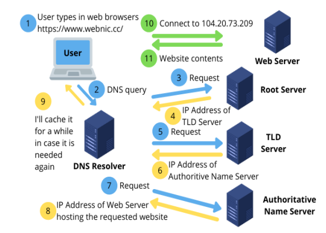
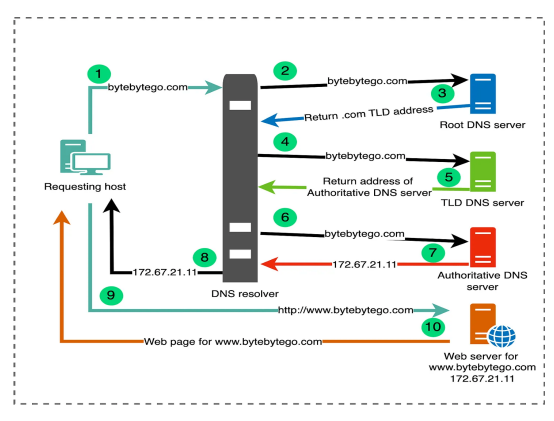
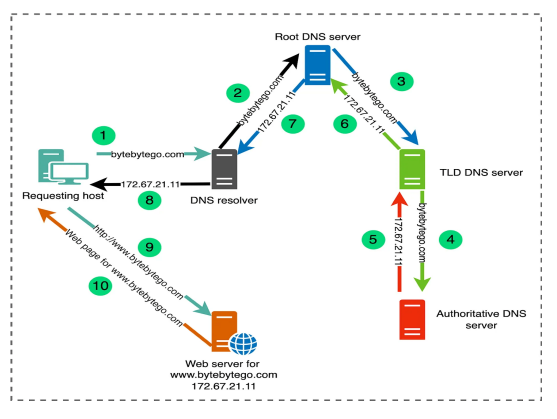

# Module 1

1. Protocals
2. Web System Architecture
3. DNS Server - Diff. Types

## 1. Protocols

- Internet relies on numorous protocols to work properly
- Protocols are standards which enable the **_connection_**, **_communication_** and **_data transfer_** between two computers
- The Internet Protocal suite consists of various set of protocals
  - **TCP/IP** - Transmission Control Protocol/Internet Protocol
  - **HTTP** - Hypertext transfer protocol
  - **HTTPS** - Hypertext transfer protocol secure
  - **FTP** - File Transfer Protocal
  - **UDP** - User Datagram Protocal

- TCP IP Protocal
  - Defines how electronic devices should connect to the network
  - in os itself the TCP IP protocaol is embedded
  - TCP handels communication between devices
    - fixeds connection Protocol
    - Communication
      - it sends a request
      - request should be sent to the exact address
      - only after handshake the communication line opens
  - TCP IP Handshake
    - A send SYN to B
    - B recieves SYN from A
    - B sends ACK and SYN to A
    - A recives Both from B
    - A send ACK to B
    - B recieves ACK from A
    - **Socket connection is Established**
  - IP - Internet Protocal
    - IP handels the Communivcation between Computers
    - IP responsibiliy is to route each packet to its correct destination
    - IP communication breaks the message into pieces and send to the destination
    - IP is a connectionless Protocol
    - Every Computer have an IP address
  - TCP and IP
    - TCP and IP work together
    - TCP takes care of the communication between app soft and net soft
    - IP takes care of comm between different computers
    - TCP is responcible for breaking the packets before sending and attaching them after recieving
    - IP is responsible for routing the packets to correct destination
    - IPv4 : 32 BIT
    - IPv6 : 128 BIT
- HTTP
  - HTTP takes care of communication between web browser and web server
  - Before HTTP FTP was used
  - HTTP uses concept called hyperlinks
  - 4 messages of the protocal
    - Connection - establish- connection - client -server
    - Request - Ask for resource
    - Response - Delivers the resource
    - Close - Terminates the connection
- HTTPS
  - HTTP Secure
  - also called as HTTP over TLS(Transport Layer Security) / HTTP over SSL (secure socket layer)
  - It is for secure connection over Internet
  - Guarentees Identity of the server
- FTP
  - Used to transfer files from one computer to another computer
  - Authentication using a clear-text protocol
  - Anonymous connection can be allowed
  - FTPS - Secure FTP
- UDP
  - Connectionless
  - No handshake
  - No guarantee of delivery
  
## WEB-SYSTEM ARCHITECTURE

Refer this here [WEB-SYSTEM ARCHITECTURE](https://medium.com/@softkraft/web-application-architecture-complete-guide-diagrams-1b2d77fe3d2e)

## DNS SERVER and Different Types

- How does Information get to me

    1. user types the url to the browser and this reqest is sent to the **DNS Resolver**
    2. DNS Resolver get the URl from the USER
    3. DNS resolver sends the request to **Root server**
    4. Root server sends IP Address of the **TLD SERVER** to DNS Resolver
    5. DNS resolver will send the request to TLD SERVER
    6. TLD server recives the requst from DNS Resolver and TLD Server sends the IP Address of Authoritive Name Server
    7. DNS Resolver sends request to Authoritive Name Server
    8. ANS will send the IP address of the web server-hosting the requested website
    9. DNS Resolver will cache it for a while incase it is needed again

### DNS HIERARCHY

#### Root DNS SERVERS

- At the top of hierarchy are the root server
- at root servers are contacted whaen a server is not actually able to resolve a name
- Much of the infrastructure associated with the root servers is the responsibility of ICANN (Internet Corporation for Assigned Names and Numbers)
- There are 13 logical root servers around the world
  - but each of these logical root servers is Actually replicated, so corresponding to these 13 logical servers are actually close to a thousand physical servers around the world

#### Top-Level Domain (TLD) DNS servers

- Each TLD server is responsible for resolving one of the Address that have ending like `e .com, .edu, .net, and .org`
  - All top-level country domains like `uk, fr, ca, in, etc`

#### Authoritative DNS servers

- Authoritative servers are the definitive source for domain name resolutions within their specific domain
- They store the actual name-to-IP address mappings for a given domain
- Domain owners or administrators configure their domain’s records, but the actual infrastructure—the DNS servers—is often maintained and operated by DNS hosting providers or registrars like `Cloudflare, Namecheap, GoDaddy` and others

#### Recursive DNS Servers (Resolver)

- Recursive servers handle DNS queries from client devices like computers and smartphones
- When a device wants to resolve a domain name, it contacts these servers. Acting on behalf of the client, recursive servers traverse the DNS hierarchy, consulting various DNS servers to determine the IP address associated with a domain name
- hence they obtain the answer, they return it to the client or efficiency, recursive servers often cache responses to avoid repeatedly querying the same information

##### How DNS Resolution Works

- 2 Types
  - **Iterative query resolution**

  - **Recursive query resolution**

